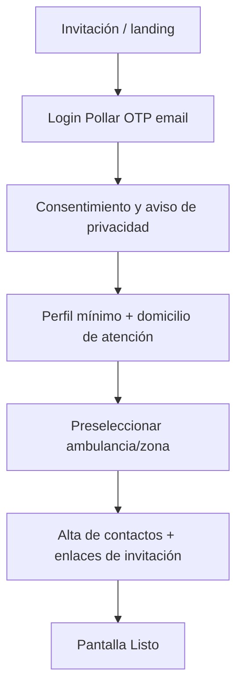
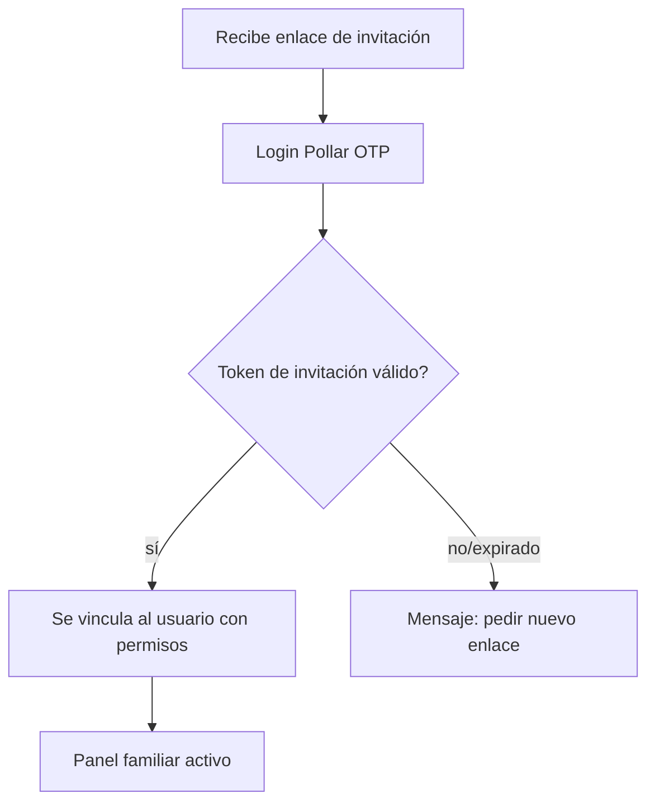
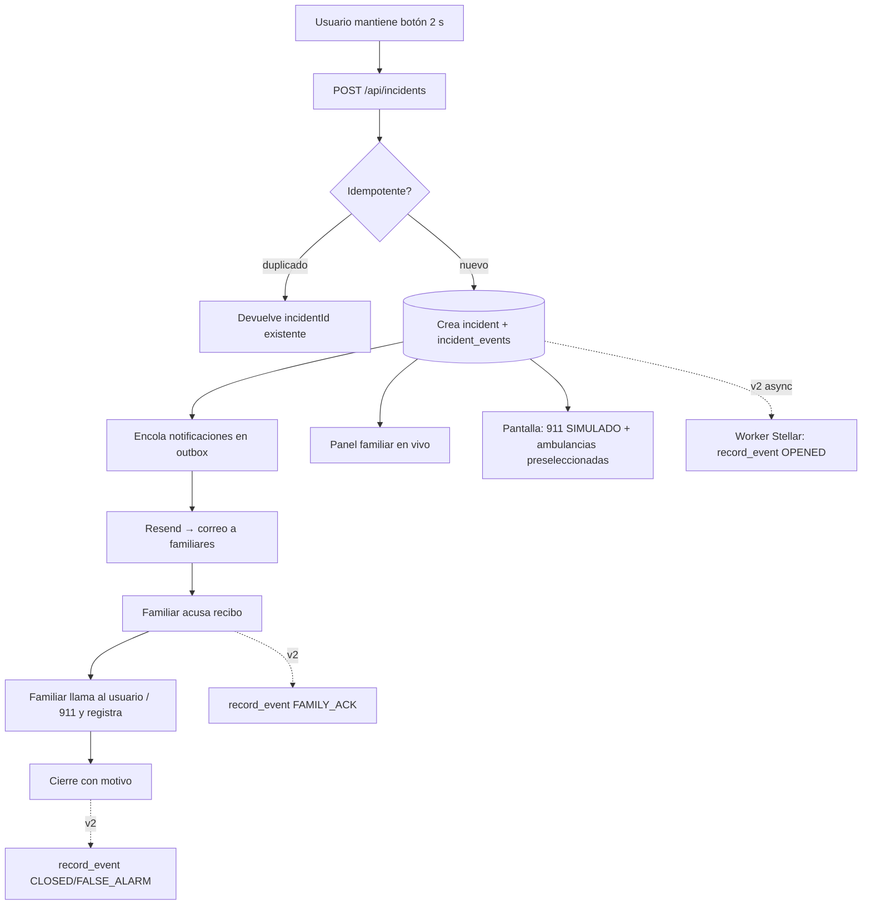
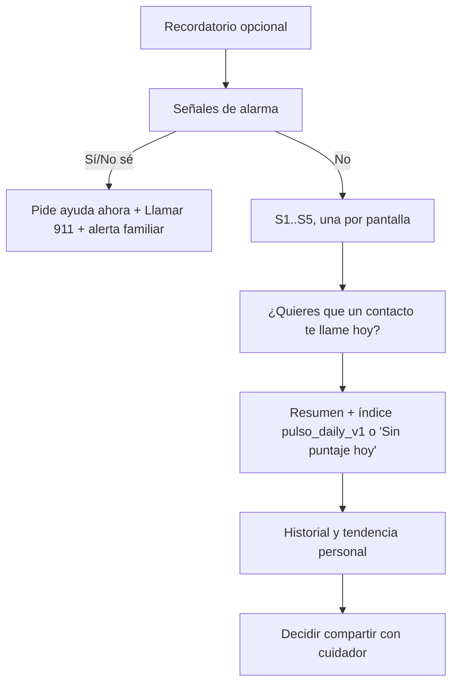
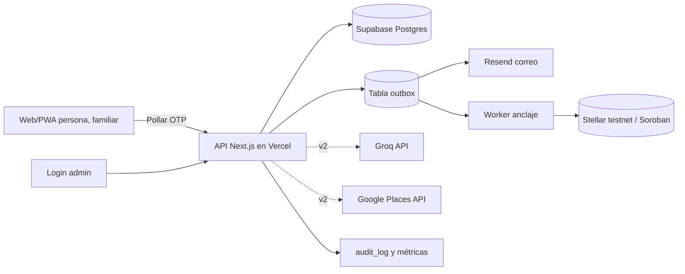

# Pulso — Especificación maestra (PDR · TRD · UX/UI · Flujos · Backend · Tickets)

**Versión:** 1.0 · **Fecha:** 27 de septiembre de 2026 · **Idioma:** es-MX · **Mercado:** México (piloto: Ciudad de México)
**Estado:** guía de implementación para hackathon · **Runway:** 1–2 semanas · **Niveles de entrega:** Objetivo mínimo (v1, mock) → MVP (v2, completo)

> **Aviso importante (leer siempre).** Pulso es un **prototipo**. Una alerta por correo o en un panel **no** equivale a un reporte recibido por el 911 ni por una ambulancia. En esta versión el "aviso automatizado a autoridades" es **simulado y así se etiqueta en la interfaz**. Lo único real es: el correo al familiar, el panel familiar y el registro manual de la llamada. En una urgencia verdadera, una persona debe **llamar al 911**. El equipo no tiene convenio con autoridades. Pulso **no diagnostica** ni sustituye atención médica.

---

## 0. Cómo leer este documento y evaluación de los .md previos

Este documento consolida y actualiza dos archivos previos del equipo:

- `LANDING_PULSO.md` — spec de landing/experiencia web.
- `PDR_TRD_emergencias_MX.md` — PDR/TRD detallado.

**Qué se conserva de ellos (era sólido):**

1. **Manejo honesto del 911:** nunca mostrar "autoridad avisada" sin confirmación real. Se mantiene y se extiende con un **modo simulacro** explícito.
2. **Privacidad por diseño:** datos de salud como sensibles (LFPDPPP), cifrado fuera de cadena, **nada personal/clínico en Stellar**, IP tratada como dato personal.
3. **Contrato Soroban de anclaje** con `commitment = hash(... || nonce)` y `nonce` fuera de cadena.
4. **Índice diario `pulso_daily_v1`** (5 preguntas, 0–100) y **señales de alarma** previas al puntaje.
5. **Accesibilidad:** WCAG 2.2 AA, botones grandes, texto ≥18 px, no depender solo del color, paleta con contrastes verificados.

**Qué cambia respecto a los .md previos (decisiones nuevas, ya confirmadas):**

| Tema | Antes (.md previos) | Ahora (esta spec) |
|---|---|---|
| Disparo de alerta | Doble pulsación física ESP32 en 3 s | **Botón web/PWA "mantener pulsado 2 s"**. ESP32/collar y widget Android nativo → **futuro/stretch** |
| Correo | Gmail API | **Resend** |
| Base de datos | PostgreSQL genérico | **Supabase** (Postgres + RLS + Storage) |
| Actores | usuario, familiar, admin (mínimo) | 3 roles con **dashboard admin con métricas + IA** y **recomendaciones de lugares** |
| Círculo familiar | alta de contactos | **enlaces de invitación** para que el familiar se una |
| 911 | solo escalamiento manual | **aviso automatizado simulado** + **números de ambulancia según selección previa** + escalamiento manual |
| IA | no definida | **Groq API** (solo v2) |
| Lugares cercanos | no definido | **v1 mock** (seed CDMX) → **v2 Google Places** |

---

## 1. Resumen ejecutivo y alcance

### 1.1 Qué es Pulso

Pulso conecta un **botón de ayuda sencillo** con una **red familiar** y un **seguimiento diario de bienestar**, pensado para **adultos mayores y personas con enfermedades** en México. Cuando la persona pide ayuda, sus familiares se enteran, se organizan (quién responde, quién llama) y quedan a la vista los teléfonos de ambulancia que la persona eligió con antelación. Además, un chequeo diario tipo Whoop ayuda a notar cambios a tiempo.

**Lema:** *Tu red de apoyo, cuando más importa.*

### 1.2 Para quién

- **Usuario (adulto senior / persona con enfermedad):** pide ayuda y responde su chequeo diario.
- **Familiar / cuidador:** recibe alertas, confirma quién atiende, llama y registra acciones.
- **Administrador del proyecto:** opera la plataforma, ve métricas agregadas y (v2) recibe apoyo de IA con recomendaciones generales y lugares cercanos.

### 1.3 Qué **no** es (límites explícitos)

- No es una central de emergencias ni tiene convenio con el 911/C5.
- No diagnostica, no hace triaje clínico automatizado, no promete tiempos de respuesta.
- El "aviso a autoridades" en esta versión es **simulado**.
- Stellar prueba integridad temporal de un registro, **no** que ocurrió una emergencia.
- El índice diario es autorreporte, **no** una escala clínica validada.

### 1.4 Dos niveles de entrega

| Nivel | Nombre | Contenido |
|---|---|---|
| **v1** | **Objetivo mínimo (mock)** | Flujo núcleo funcionando end-to-end con datos mock: auth, botón de pánico web, incidente, correo Resend, panel familiar, 911 simulado + ambulancias, chequeo diario, recomendaciones/lugares mock, deploy en Vercel. |
| **v2** | **MVP** | v1 + Google Places real, Groq API (recomendaciones usuario/admin), contrato Soroban en testnet + anclaje, dashboard admin con métricas, endurecimiento de privacidad/RLS, PWA instalable y pruebas de accesibilidad. |
| **Futuro** | **Stretch** | Collar ESP32, widget nativo Android, ubicación en tiempo real, integración real con autoridades. |

---

## 2. PDR — Requisitos de producto

### 2.1 Problema y propuesta

Una persona puede necesitar ayuda y no tener el teléfono a la mano, o no saber a quién llamar. Pulso ofrece un **botón único** que crea una alerta, **avisa a la familia** de inmediato, **muestra los teléfonos de ambulancia** que la persona ya había elegido, guía la **llamada al 911** y conserva una **bitácora verificable** de lo ocurrido. El **chequeo diario** permite a la persona (y a quien ella autorice) notar cambios de bienestar.

### 2.2 Actores y "jobs to be done"

| Actor | Necesita hacer |
|---|---|
| **Usuario senior** | Pedir ayuda en 1 gesto claro; ver si la alerta se recibió; completar/omitir el chequeo diario; gestionar contactos y permisos; **preseleccionar su ambulancia/zona**; invitar a su familia. |
| **Familiar/cuidador** | Recibir el aviso; confirmar recepción; llamar a la persona y al 911 según el caso; registrar la llamada; ver solo la información compartida. |
| **Administrador** | Gestionar usuarios/permisos; ver **métricas agregadas**; (v2) obtener **recomendaciones de IA** y **farmacias/hospitales cercanos**; auditar; **sin acceso clínico por defecto**. |

### 2.3 Criterios de aceptación y métricas

| Resultado | Criterio de aceptación | Métrica |
|---|---|---|
| Botón de pánico | Mantener 2 s crea **un** incidente; clics repetidos no lo duplican | Latencia clic→backend; tasa de duplicados = 0 |
| Contactos | Cada intento de correo queda registrado con estado del proveedor | Tiempo hasta envío; tasa de fallo |
| Familiar | Puede acusar recibo y registrar llamada con sello de tiempo | Tiempo hasta acuse; hasta primer contacto |
| 911 simulado | La UI deja claro que el aviso a autoridad es **simulado**; muestra ambulancias preseleccionadas como `tel:` | Comprensión en prueba de usuarios |
| Persona | Ve estados comprensibles: "Alerta enviada / En revisión / Ayuda solicitada / Cerrada" | Comprensión en prueba |
| Cadena (v2) | Se observa transacción en testnet que coincide con el evento interno | % de eventos anclados; retraso |
| Diario | 5 respuestas válidas → 0–100; incompleto → "Sin puntaje hoy"; se puede omitir | Tasa de finalización; abandono |

### 2.4 Fuera de alcance (esta versión)

Integración real con 911/C5; diagnóstico o triaje automatizado; rastreo continuo de ubicación sin hardware/teléfono que lo aporte; promesa de entrega inmediata o atención 24/7 por el equipo; historia clínica detallada antes de cerrar consentimiento/retención.

---

## 3. Arquitectura de perfiles y roles

### 3.1 Matriz de capacidades

| Capacidad | Usuario | Familiar | Admin |
|---|---|---|---|
| Login Pollar (OTP email) | ✅ | ✅ | ❌ (login aparte) |
| Botón de pánico | ✅ | ❌ | ❌ |
| Preseleccionar ambulancia/zona | ✅ | ❌ | ❌ |
| Enviar invitaciones a familia | ✅ | ❌ | ❌ |
| Recibir alertas por correo | ❌ | ✅ | ❌ |
| Acusar recibo / registrar llamada | ❌ | ✅ | ❌ |
| Chequeo diario | ✅ | ❌ | ❌ |
| Ver perfil compartido del usuario | — | ✅ (solo lo autorizado) | ⚠️ solo agregados/no clínico por defecto |
| Recomendaciones de salud personales | ✅ (v2 Groq) | ❌ | ❌ |
| Dashboard de métricas | ❌ | ❌ | ✅ |
| Recomendaciones IA generales + lugares | ❌ | ❌ | ✅ (v2) |
| Auditoría | ❌ | ❌ | ✅ |

### 3.2 Autenticación por rol

- **Usuario y Familiar:** **Pollar** (OTP por correo + wallet embebida Stellar). El rol interno se asigna al asociar la identidad Pollar a un registro `users`.
- **Admin (solo demo):** login **separado** con credenciales **hardcodeadas** `admin@pulso.com` / `12341234`.
  - ⚠️ **Seguridad:** estas credenciales van en **variables de entorno** (`ADMIN_EMAIL`, `ADMIN_PASSWORD_HASH`), **nunca** en el repositorio ni en `NEXT_PUBLIC_*`. Es un atajo **solo para la demo**; para producción debe reemplazarse por un rol real con contraseña por usuario, hash fuerte (bcrypt/argon2) y MFA.

### 3.3 Matriz de acceso a datos sensibles

- Respuestas de salud y puntaje: **propiedad del usuario**; el familiar solo las ve si la persona activó `share_scope`; el admin **no** por defecto.
- Domicilio, teléfono, IP del incidente y (futuro) coordenadas: **cifrados fuera de cadena**, acceso mínimo por rol, cada consulta de familiar/admin se registra en `audit_log`.
- En la demo pública: usar **nombre/domicilio/respuestas ficticios o enmascarados** aunque el correo y el flujo sean reales.

---

## 4. UX/UI

### 4.1 Principios verificables

- **Una acción principal por pantalla**, lenguaje cotidiano, estados concretos.
- **Botones ≥ 52 px** de alto (meta cómoda; WCAG 2.2 AA exige ≥ 24 px), separación ≥ 12 px, texto de cuerpo **≥ 18 px** y línea 1.5.
- **Texto + icono**, nunca solo color. Contraste AA, foco de teclado visible, `prefers-reduced-motion`.
- Confirmación inmediata y explicación de fallos: *"No se pudo enviar. Intenta de nuevo o llama al 911."*
- Sin jerga de blockchain en el flujo diario; la constancia verificable aparece como "detalle del incidente".

### 4.2 Tokens de color (paleta conservada)

```css
:root {
  --color-background: #f7fafc;   /* fondo general      texto #172b4d 13.45:1 */
  --color-surface:    #ffffff;   /* tarjetas           texto #172b4d 14.10:1 */
  --color-text:       #172b4d;   /* texto principal */
  --color-text-secondary:#4b5563;/* secundario         7.56:1 sobre blanco */
  --color-primary:    #0d5c63;   /* botones/nav        blanco 7.70:1 */
  --color-danger:     #b42318;   /* NECESITO AYUDA     blanco 6.57:1 */
  --color-success:    #146c43;   /* confirmado         blanco 6.45:1 */
  --color-warning:    #B45309;   /* modo simulacro     blanco 4.9:1  */
  --color-focus:      #1d4ed8;   /* foco de teclado    6.70:1 */
  --color-border:     #64748b;   /* bordes             4.76:1 */
}
```

> **Rojo** solo para pedir ayuda / incidente activo. **Ámbar (`--color-warning`)** identifica todo lo que es **simulado** (aviso 911 simulado).

### 4.3 Mapa de pantallas por rol

```text
[Público]
  Landing → CTA "Entrar"

[Usuario senior]  (Pollar)
  Alta y permisos → Preselección de ambulancia/zona → Invitar familia
  Inicio: [ NECESITO AYUDA ] [ Chequeo de hoy ] [ Mis contactos ] [ Recomendaciones ]
    ├─ Incidente activo → progreso · familiares avisados · 911 (SIMULADO) · Ambulancias · Llamar 911
    ├─ Chequeo → señales de alarma → 1 pregunta por paso → contacto → resumen e índice → historial
    ├─ Contactos y permisos (+ enlaces de invitación)
    └─ Recomendaciones (v1 mock · v2 Groq + Places)

[Familiar]  (Pollar, por enlace de invitación)
  Panel: Alertas (nuevas / atendidas / cerradas)
    ├─ Detalle: cronología · domicilio · ambulancias · [Confirmo recibí] [Llamé al 911] · cierre
    └─ Perfil compartido (solo lo autorizado)

[Admin]  (login hardcodeado demo)
  Dashboard: métricas (usuarios, incidentes, latencias, acuses, check-ins)
    ├─ Usuarios / dispositivos / permisos / auditoría
    └─ (v2) Recomendaciones IA + farmacias/hospitales cercanos
```

### 4.4 Prototipos textuales de pantallas clave

**Inicio del usuario**
```text
┌───────────────────────────────────────┐
│ Hola, Ana                             │
│ Sesión activa · Ambulancia: Cruz Roja │
│                                       │
│ [ 🔴  NECESITO AYUDA  (mantén 2 s) ]  │
│                                       │
│ [ Hacer mi chequeo de hoy ]           │
│ [ Ver mis contactos de ayuda ]        │
│ [ Recomendaciones para mí ]           │
└───────────────────────────────────────┘
```

**Incidente activo (con 911 simulado + ambulancias)**
```text
┌───────────────────────────────────────┐
│ Estamos avisando a tu familia…        │
│ ✓ Recibida por el sistema             │
│ ✓ Familiares: correo enviado          │
│ ○ Familiar: pendiente de confirmar    │
│                                       │
│ ⚠ Aviso a autoridades: SIMULADO       │
│   (no se contactó a ninguna autoridad)│
│                                       │
│ Ambulancias que elegiste:             │
│  [ 📞 Cruz Roja  065 ]                │
│  [ 📞 ERUM       911 ]                │
│                                       │
│ [ 📞 Llamar al 911 ]  [ Ver detalles ]│
└───────────────────────────────────────┘
```

### 4.5 Comportamiento interactivo mínimo

| Pantalla | Acción | Respuesta visible | Estado de error |
|---|---|---|---|
| Inicio | Mantener "NECESITO AYUDA" 2 s | Barra de progreso 0→2 s; al soltar antes, se cancela; al completar, "Enviando…" y luego `incidentId` | "No pudimos confirmar el envío" + `tel:911` |
| Incidente | 911 simulado | Banner ámbar "SIMULADO — no se avisó a ninguna autoridad" | — |
| Incidente | "Confirmo que recibí la alerta" (familiar) | Nombre + hora en cronología, visible para otros familiares | Reintento sin duplicar acuse |
| Incidente | "Llamé al 911" (familiar) | Pide hora/resultado/folio opcional → "Llamada registrada" | Nunca marcar "autoridad avisada" solo por abrir `tel:` |
| Chequeo | Señales de alarma = Sí / No estoy seguro | Mostrar de inmediato "Pide ayuda ahora", "Llamar al 911" y opción de alerta familiar | Mantener visibles los medios de ayuda si falla el guardado |
| Chequeo | "Siguiente" / "Terminar" | Progreso "2 de 5"; al terminar, índice o "Sin puntaje hoy" | Conservar respuestas si se interrumpe; no duplicar día |

---

## 5. Flujos end-to-end

### 5.1 Alta del usuario



### 5.2 Alta del familiar (por enlace)



### 5.3 Emergencia (flujo principal)



Reglas: reintentos conservan los tiempos del **primer** evento aceptado y **no** crean incidentes nuevos. Si falla Stellar, los avisos continúan y el anclaje se reintenta por separado.

### 5.4 Chequeo diario



### 5.5 Admin (dashboard + IA)

```mermaid
flowchart TD
  A[Login admin hardcodeado] --> B[Dashboard de métricas]
  B --> C[Usuarios / permisos / auditoría]
  B --> D[(v2) Recomendaciones IA - Groq]
  B --> E[(v2) Farmacias/hospitales cercanos - Places]
```

---

## 6. TRD — Arquitectura técnica y backend esquemático

### 6.1 Vista general de componentes



**Elección:** Next.js (App Router) + TypeScript en Vercel; Supabase administrado; patrón **outbox** en tabla (consumidores **idempotentes**, entrega al menos una vez); contrato Soroban en Rust; Resend para correo. Las tareas críticas **no** dependen de cron de Vercel Hobby (limitado y sin reintento propio); el disparo de outbox se hace tras la escritura del incidente y con reintento.

### 6.2 Contratos de API (resumen)

| Recurso | Endpoint | Notas |
|---|---|---|
| Incidentes | `POST /api/incidents` | Crea incidente; **idempotente** por `Idempotency-Key`/`client_event_id`; responde `incidentId, status, serverTime` |
| Incidentes | `GET /api/incidents/:id` | Estado + cronología (según permisos) |
| Incidentes | `POST /api/incidents/:id/ack` | Acuse del familiar (no duplica) |
| Incidentes | `POST /api/incidents/:id/call-log` | Registrar llamada 911 (hora/resultado/folio opcional) |
| Incidentes | `POST /api/incidents/:id/close` | Cierre con motivo (`resolved`/`false_alarm`) |
| Notificaciones | `GET /api/incidents/:id/notifications` | Estado por destinatario |
| Contactos | `GET/POST/PATCH /api/contacts` | Alta/verificación/permisos |
| Invitaciones | `POST /api/invites` · `GET /api/invites/:token` · `POST /api/invites/:token/accept` | Enlace de un solo uso, con expiración |
| Chequeo | `POST /api/checkins` · `GET /api/checkins` | 1 por `user_id`+`local_day`; puntaje **en servidor** |
| Perfil/ambulancia | `GET/PATCH /api/profile` | Incluye `preferred_ambulance`, `zone` |
| Lugares | `GET /api/places?type=pharmacy|hospital|doctor` | v1 lee `places` seed; v2 Google Places |
| IA | `POST /api/ai/recommendations` | v2 Groq; entra tendencia de checkins (con consentimiento) |
| Admin | `GET /api/admin/metrics` | Agregados; requiere sesión admin |
| Dispositivo (futuro) | `POST /api/device-events` | ESP32; firma + dedup por `(device_id, counter)` |

### 6.3 Máquina de estados del incidente

```text
created → family_acknowledged → contacting → resolved
                                          ↘ false_alarm
```

### 6.4 Modelo de datos (Supabase / Postgres)

```text
users(id, pollar_subject, role[user|family|admin], email, created_at)
profiles(user_id, display_name, phone_encrypted?, address_encrypted?,
         preferred_ambulance, zone, consent_version, share_scope)
contacts(id, user_id, name, email, relationship, verified_at, permissions)
family_invites(id, user_id, token_hash, email?, status[pending|accepted|expired],
               created_at, expires_at, accepted_by?)
incidents(id, user_id, source_channel[web|esp32], status, opened_at_utc,
          closed_at_utc?, close_reason?, address_snapshot_encrypted?,
          source_ip_encrypted?, client_event_id UNIQUE)
incident_events(id, incident_id, seq, type, actor_id?, at_utc, metadata_private,
                UNIQUE(incident_id, seq))
notifications(id, incident_id, contact_id, channel[email], status[queued|sent|failed|acknowledged],
              attempts, provider_id?, updated_at)
outbox(id, kind[email|anchor], payload_json, status[pending|processing|done|failed],
       attempts, next_attempt_at, dedup_key UNIQUE)
daily_checkins(id, user_id, local_day, answers_encrypted, score_version,
               score_0_100?, completed_at_utc?, share_scope, UNIQUE(user_id, local_day))
contact_requests(id, user_id, checkin_id?, status, created_at_utc, acknowledged_at_utc?)
places(id, type[pharmacy|hospital|doctor], name, address, phone, zone, lat?, lng?, source[seed|places])
ambulance_numbers(id, zone, name, phone, is_public)          -- catálogo para preselección
ai_recommendations(id, user_id?, scope[user|admin], input_hash, output_text, model, created_at)
chain_anchors(id, incident_event_id, case_key, seq, commitment, tx_hash?, network,
              ledger_closed_at_utc?, status, retries)
audit_log(id, actor_id, action, object_type, object_id, at)
```

**Índices únicos anti-duplicado:** `incidents.client_event_id`, `(incident_id, seq)`, `daily_checkins(user_id, local_day)`, `outbox.dedup_key`, `family_invites.token_hash`.

**Tiempos:** guardar en UTC/ISO 8601 (`opened_at_utc` como referencia operativa; `ledger_closed_at_utc` de Stellar en v2). Mostrar en `America/Mexico_City` con zona visible.

### 6.5 Seguridad y privacidad

- **LFPDPPP:** datos de salud = sensibles. Aviso de privacidad, finalidad específica, consentimiento expreso para salud, derechos ARCO, retención y controles de acceso antes de usar datos reales.
- Datos clínicos y domicilio **cifrados** fuera de cadena; **RLS** en Supabase como defensa en profundidad (política por `user_id`/rol); acceso servidor con **service role** solo desde rutas del backend.
- **IP** del incidente = dato personal: se toma del mecanismo confiable de Vercel (no de un campo enviado por el cliente), se guarda **cifrada**, no aparece en correos ni panel, con plazo de retención definido.
- **Secretos** en variables de entorno; nunca en `NEXT_PUBLIC_*` ni en Git; rotación de credenciales.
- **Admin hardcodeado** = solo demo (ver §3.2).

### 6.6 Contrato Stellar (v2)

**Propósito:** constancia verificable de apertura/acuse/cierre de un incidente, **sin datos personales**.

```text
initialize(admin_address)
record_event(case_key, seq, event_code, server_received_at_unix, commitment)
get_case_state(case_key) -> (last_seq, closed)
```

- `record_event` exige `require_auth()` de la cuenta de servicio, `seq = last_seq + 1`, caso abierto; `OPENED` solo con `seq = 1`; `CLOSED`/`FALSE_ALARM` cierran.
- Público en cadena: `case_key` (32 bytes aleatorios), `seq`, `event_code`, `server_received_at_unix`, `commitment`, cuenta firmante, `tx_hash`/ledger.
- **Fuera de cadena:** `nonce` (32 bytes por evento), registro completo, vínculo `case_key ↔ persona`, IP, horas privadas, respuestas de salud. `commitment = SHA-256(version || case_key || seq || event_code || server_received_at_unix || registro_canonico || nonce)`.
- La firma la hace una **cuenta de servicio del backend**; el usuario y el familiar **no** esperan wallet ni confirmación de Stellar para pedir/atender ayuda. Pollar aporta identidad + wallet embebida.

### 6.7 Variables de entorno previstas

```text
# Pollar
NEXT_PUBLIC_POLLAR_PUBLISHABLE_KEY=
POLLAR_SECRET_KEY=
# Supabase
NEXT_PUBLIC_SUPABASE_URL=
SUPABASE_SERVICE_ROLE_KEY=
# Resend
RESEND_API_KEY=
RESEND_FROM=alertas@tu-dominio-verificado.mx
# Admin demo
ADMIN_EMAIL=admin@pulso.com
ADMIN_PASSWORD_HASH=          # hash de 12341234 (NO texto plano)
# Cifrado de datos sensibles
DATA_ENCRYPTION_KEY=
# v2
GROQ_API_KEY=
GOOGLE_PLACES_API_KEY=
STELLAR_NETWORK=testnet
STELLAR_CONTRACT_ID=
STELLAR_SERVICE_SECRET=
```

### 6.8 Despliegue en Vercel

Monorepo (web/API, `contract/` Soroban, `firmware/` ESP32 futuro). Variables separadas para `preview` (datos sintéticos + testnet) y `production`. Dominio HTTPS; migraciones controladas; alertas de errores. Ninguna clave secreta en `NEXT_PUBLIC_*`.

---

## 7. Simulacro de 911 y ambulancias

- **Aviso automatizado a autoridad = SIMULADO.** En el incidente se muestra un banner **ámbar**: *"Aviso a autoridades: SIMULADO — no se contactó a ninguna autoridad real."* Internamente se registra un `incident_event` `type = auth_notice_simulated` para la demo; **nunca** se muestra "autoridad avisada".
- **Números de ambulancia según selección previa.** En el alta, el usuario elige su **zona** y una o más opciones de `ambulance_numbers` (p. ej. Cruz Roja `065`, ERUM/911, servicio privado). En un incidente, esos teléfonos aparecen como botones `tel:` visibles para la persona y el familiar. El **911** siempre está disponible como `tel:911`.
- **Qué es real vs simulado:**

| Elemento | Estado |
|---|---|
| Correo al familiar (Resend) | **Real** |
| Panel familiar y acuse | **Real** |
| Registro manual de la llamada al 911 | **Real** (lo captura el familiar) |
| "Aviso automatizado a autoridad" | **Simulado y etiquetado** |
| Botones `tel:` de ambulancia/911 | Reales como enlaces; la llamada la hace la persona |

---

## 8. Plan de implementación por tickets

### 8.1 Objetivo mínimo — v1 (mock)

| ID | Ticket | Dependencia | Terminado cuando… |
|---|---|---|---|
| M01 | Monorepo Next.js + deploy preview en Vercel | — | URL de preview y CI funcionan; endpoint `/api/health` responde |
| M02 | Supabase: esquema, migraciones y **seed mock** (`places`, `ambulance_numbers`, usuarios de prueba) | M01 | Tablas e índices únicos creados; seed cargado |
| M03 | Auth: Pollar OTP (usuario/familiar) + roles + **login admin hardcodeado** (env) | M01 | Cada rol entra y no ve datos de otro rol; admin entra por ruta aparte |
| M04 | Perfil, contactos, **preselección ambulancia/zona** e **invitaciones** | M02, M03 | Se completa alta; enlace de invitación crea familiar vinculado |
| M05 | **Botón de pánico web (mantener 2 s)** → `POST /api/incidents` idempotente | M03 | 2 s crea 1 incidente; clics repetidos no duplican |
| M06 | Outbox + **Resend** a familiar + panel familiar + acuse/cierre | M05 | Correo recibido abre el caso; acuse y cierre auditados |
| M07 | **911 simulado** + ambulancias preseleccionadas (`tel:`) | M05 | Banner "SIMULADO" visible; teléfonos correctos por zona |
| M08 | **Chequeo diario `pulso_daily_v1`** + señales de alarma | M04 | 5 respuestas → 0–100; incompleto → "Sin puntaje"; alarma ofrece ayuda inmediata |
| M09 | Recomendaciones y lugares **mock** (usuario) | M02 | Lista de farmacias/hospitales/doctores desde seed |
| M10 | Ensayo end-to-end + capturas (modo simulacro) | M05–M09 | Dos ejecuciones seguidas sin duplicados |

### 8.2 MVP — v2

| ID | Ticket | Dependencia | Terminado cuando… |
|---|---|---|---|
| V01 | **Google Places** real (con permiso de ubicación) | M09 | Lugares cercanos reales; fallback a seed si no hay permiso/limite |
| V02 | **Groq API**: recomendaciones del usuario (tendencia de checkins, con consentimiento) | M08 | Recomendación generada y cacheada; sin datos sensibles en logs |
| V03 | **Groq API**: recomendaciones generales del admin + resúmenes | V04 | El admin ve recomendaciones agregadas, no clínicas por defecto |
| V04 | **Dashboard admin con métricas** (usuarios, incidentes, latencias, acuses, checkins) | M06 | Métricas correctas y auditoría visible |
| V05 | **Contrato Soroban** en testnet (`initialize/record_event/get_case_state`) | M05 | Apertura/transición/cierre verificables en explorador |
| V06 | **Worker de anclaje + conciliación** (outbox `kind=anchor`) | V05, M06 | Fallo de Stellar no bloquea alertas; luego se recupera; `tx_hash` ligado al incidente |
| V07 | **Endurecimiento** privacidad/RLS/consentimiento/cifrado + retención de IP | M06 | RLS activo; datos sensibles cifrados; aviso de privacidad publicado |
| V08 | **PWA instalable** + pruebas de accesibilidad con 3–5 usuarios objetivo | M07, M08 | Instalable; usuarios completan botón y chequeo sin ayuda |

### 8.3 Futuro / stretch

| ID | Ticket | Nota |
|---|---|---|
| F01 | Firmware **ESP32** (GPIO, HTTPS, firma, reintento, LED) | Reintroduce `POST /api/device-events` y dedup por `(device_id, counter)` |
| F02 | **Widget nativo Android** (App Widget) | Build Kotlin separado que llama a la API |
| F03 | **Ubicación en tiempo real** con consentimiento | Geolocalización del teléfono o hardware de posicionamiento |
| F04 | Integración **real** con autoridades | Requiere convenio técnico y legal; solo entonces retirar "SIMULADO" |

### 8.4 Ruta crítica priorizada

`M01 → M02 → M03 → M05 → M06 → M07` (loop de emergencia real por correo + 911 simulado) es lo mínimo demostrable. Luego `M08` (chequeo), `M04` (invitaciones), `M09` (mock lugares). En v2, priorizar `V04` (dashboard), `V01/V02` (Places/Groq) y `V05/V06` (Stellar).

---

## 9. Riesgos y pruebas obligatorias

| Riesgo | Respuesta |
|---|---|
| Correo tardío / no recibido | Estado por destinatario, reintentos idempotentes, canal alterno y protocolo humano; no prometer entrega |
| Botón accidental / repetido | Requerir mantener 2 s, deshabilitar reenvíos en UI, `client_event_id` + dedup en servidor, flujo de falsa alarma que no borra historial |
| Familiar no disponible | Definir familiar principal, suplente y plazo de escalamiento antes de piloto |
| Datos sensibles expuestos | Mínimo de datos, consentimiento, cifrado, RLS, permisos, auditoría; nada clínico en cadena |
| Fallo de Stellar/Pollar/Groq | La alerta continúa si falla Stellar; acceso alterno si falla login; IA es opcional y degradable |
| Honestidad del 911 simulado | Banner ámbar permanente; nunca "autoridad avisada"; instruir a llamar al 911 |
| Confianza en el índice diario | Presentarlo como autorreporte comparado con los propios días; sin etiquetas "sano/enfermo" |

**Pruebas de UX requeridas:** 3–5 personas del grupo objetivo completan sin ayuda el botón de pánico y el chequeo; registrar errores, confusiones y tiempo; ajustar antes del piloto.

---

## 10. Anexos

### 10.1 Decisiones pendientes (actualizadas)

| ID | Estado |
|---|---|
| D1 | CDMX confirmado; **pendiente** alcaldía/colonia del piloto y catálogo de `ambulance_numbers` por zona |
| D2 | Público: adultos mayores / pacientes crónicos; uso autónomo o con cuidador — **confirmar** por piloto |
| D3 | Disparo v1 = **web/PWA 2 s**; ESP32 = futuro (F01) |
| D4 | Familiares atienden; **pendiente** familiar principal/suplente y plazo de confirmación |
| D5 | Runway 1–2 semanas; dos niveles (v1/v2) |
| D6 | **Pendiente** datos clínicos a almacenar, visibilidad por rol, aviso de privacidad y consentimiento (V07) |
| D7 | Correo = **Resend**; **pendiente** dominio verificado |
| D8 | Login = **Pollar**; **pendiente** app y claves de testnet |
| D9 (nuevo) | IA = **Groq**; **pendiente** clave y prompt/guardarraíles |
| D10 (nuevo) | Lugares v2 = **Google Places**; **pendiente** clave y política de ubicación |

### 10.2 Fuentes primarias

- 911 en México — [gob.mx](https://www.gob.mx/sspc/es/articulos/sabes-cual-es-la-diferencia-entre-los-numeros-088-089-y-911) · [C5 CDMX / 911](https://bomberos.cdmx.gob.mx/servicios/servicio/Emergencias-9-1-1)
- LFPDPPP vigente — [ordenjuridico.gob.mx](https://www.ordenjuridico.gob.mx/Documentos/Federal/html/wo125102.html)
- Señales de urgencia — [CDC: infarto](https://www.cdc.gov/heart-disease/about/heart-attack.html) · [CDC: señales de emergencia](https://stacks.cdc.gov/view/cdc/47667/cdc_47667_DS1.pdf)
- WHO-5 (contexto, 2 semanas) — [WHO](https://www.who.int/publications/m/item/WHO-UCN-MSD-MHE-2024.01)
- Pollar — [SDK](https://github.com/pollar-xyz/pollar) · [ejemplo Next.js](https://github.com/pollar-xyz/pollar-docs/blob/main/docs/getting-started/example-app.md)
- Stellar — [privacidad](https://developers.stellar.org/docs/build/apps/privacy) · [autorización](https://developers.stellar.org/docs/build/guides/auth/contract-authorization) · [eventos](https://developers.stellar.org/docs/build/smart-contracts/example-contracts/events)
- Resend — [docs](https://resend.com/docs) · Supabase — [docs](https://supabase.com/docs) · Groq — [docs](https://console.groq.com/docs) · Google Places — [docs](https://developers.google.com/maps/documentation/places/web-service/overview)
- Vercel — [Queues](https://vercel.com/docs/queues/concepts) · [límites de cron](https://vercel.com/docs/cron-jobs/usage-and-pricing) · WCAG 2.2 — [W3C](https://www.w3.org/TR/wcag/)

### 10.3 Glosario

- **Incidente:** solicitud de ayuda creada por el botón de pánico.
- **Anclaje:** transacción en Stellar que registra un `commitment` de un evento del incidente.
- **`pulso_daily_v1`:** versión del cálculo del índice diario (`5 × Σ(S1..S5)`, 0–100).
- **Modo simulacro:** estado de demo donde el aviso a autoridades es simulado y así se muestra.
- **Objetivo mínimo (v1):** flujo núcleo con datos mock. **MVP (v2):** v1 + Places/Groq/Stellar/dashboard.

---

*Fin del documento. Este `.md` reemplaza y consolida `LANDING_PULSO.md` y `PDR_TRD_emergencias_MX.md` para efectos de implementación; conserva sus salvaguardas de privacidad y el manejo honesto del 911.*
